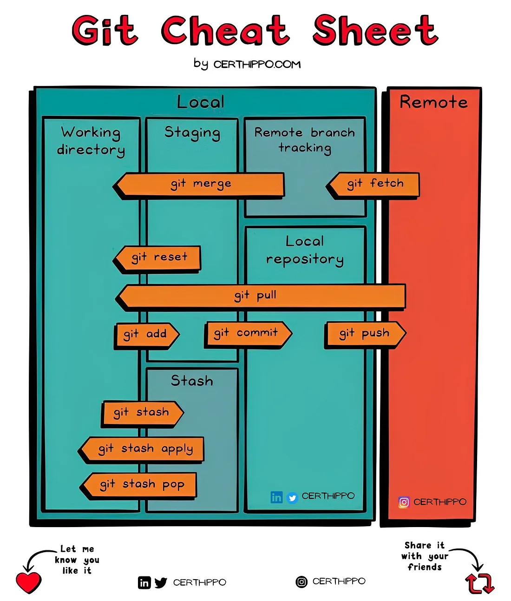
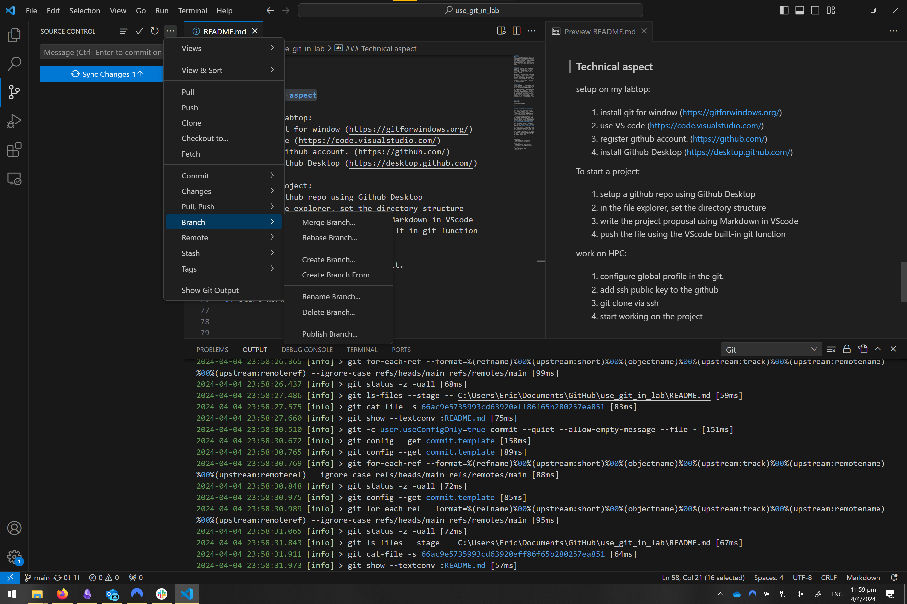

# use git in lab

### Introduction
Working on a research project may span over years, e.g. PhD projects 3-4 years. Keeping track of changes of project probably the most laborious task. To keep track of rationale and associated with the different edits to the documents will be near impossible. To facilitate the proper documentation of records, which is directly related to reproducibility of the work. Also, projects may take efforts from several individuals, using git and github helps everyone to get involved on the same project. Lastly, I think it is cool to be able to put down the url to a code repository of your work in the “Code availability” section, instead of just a vague statement. 

---

### What is git?

Git is a version control system. Version control means to manage and track changes to a project. It's a blend of the project itself together with the changelog. A common pattern in every project is that we focus on the final product itself, but ignored the project development progress which entails the rationale of the decisions that shapes each and every part of the project.  

Git is a distributed version control system, you can work on the same project on different machines, and all edits to the same repository can be combined.  This feature is beneficial for both working solo or in collaboration. Sometimes, you may need to computational resources on a HPC to work on some task, you can track changes on that if you use git. In other instance, say you are on vacation, and you want to stay completely offline while working on your project. You can do that with git. You can choose when to integrate your edits.  

Git is a popular version control system. If you search a random bioinformatics article in any journal, chances are you will find a github repository. 

---

### What is Github 

Git is not Github. Github is an online platform that host git repositories of different projects. It's like a cloud drive that store the data of the git repository ( docuemnts, codes, data files, etc ). Think of it as OneDrive or Google Drive. 

It is also a social network for developers, where you and your collaborator and strangers on the internet can view and comment and contribute to your project ( if you allow it).   

Github also have some features that enhance productivity, such as Actions and projects. If you configure it properly, you can automate tasks. For example, for each edits you may want the concensus of all your collaborator. Using github action you can configure that. Another example is related to projcet management, repo admin can assign tasks to collaborator, which helps the division of labour. But all these features are suited more to a larger projects, such as project that involves more than a dozen of people.   


--- 

### Git concept 

image credit to : 
```
https://medium.com/@myitcerts995/git-cheat-sheet-guys-f26e2d96732c
```

---

### Applying Git in a project

__Disclaimer: Use git as a tool, make the tools works for you, not the other way around.__

Let say I have a project, that will be one repository (directory or folder in my file explorer). Every data file, such as source code, documentation, or even my NGS fastq files will be stored or linked in that directory.   

I will plan out the project in the README.md in the root directory. This document maybe your project proposal, the index of your thesis. 

I have to work on different part on the projcet. For each part, I will start a new branch. This is to allow myself to work freely in this branch, knowing that the main branch remains unaltered until I merge the change in this branch to the main branch. Plus it avoid conflits with your collaborator, like in the case if you have to edit the same file. The task can be like a section in an article. A task may be __Identifying interesting regions in the genome through intergration of ChIP-seq peaks and RNA-seq result__

It usually takes days , if not weeks,  to finish working a section. So along the way I will have to save file, which will be commit with a message.  The message is the log of my edit so I will write it concisely, describe what is the aim of the change. Say I __change some parameter in peak calling. Then later on I change the peak caller used in peak calling.__

Need not worry if the change is not specific, git will know which file and which line has been edited compare to earlier version. So the strategy is to focus on one specific task for each commit, otherwise, I maybe confused when I look back in history, editing 10 different unrelated files at once.  

Then, I will merge the branch to main, if I think I am done with the task. This is a good milestone and opportunity to have a meeting with the collaborator to discuss the finding. 
After merging to main branch and push that to remote repo, the collaborator can pull the new edits through git pull, so that they have a copy of the new data. 


---

### Technical aspect

#### setup on my labtop:
1. install git for window (https://gitforwindows.org/)
2. use VS code (https://code.visualstudio.com/)
3. register github account. (https://github.com/)
5. install Github Desktop (https://desktop.github.com/)

#### To start a project:
1. setup a github repo using Github Desktop
2. in the file explorer, set the directory structure 
3. write the project proposal using Markdown in VScode
4. push the file using the VScode built-in git function


#### work on HPC: (disclaimer: setting up is kinda difficult)
1. configure global profile in the git. 
2. add ssh public key to the github (https://docs.github.com/en/authentication/connecting-to-github-with-ssh/generating-a-new-ssh-key-and-adding-it-to-the-ssh-agent)
2. git clone via ssh
3. start working on the project

--- 
### Troubleshooting
setup ssh port 
https://docs.github.com/en/authentication/troubleshooting-ssh/using-ssh-over-the-https-port  

setup user git profile
https://docs.github.com/en/get-started/getting-started-with-git/setting-your-username-in-git

